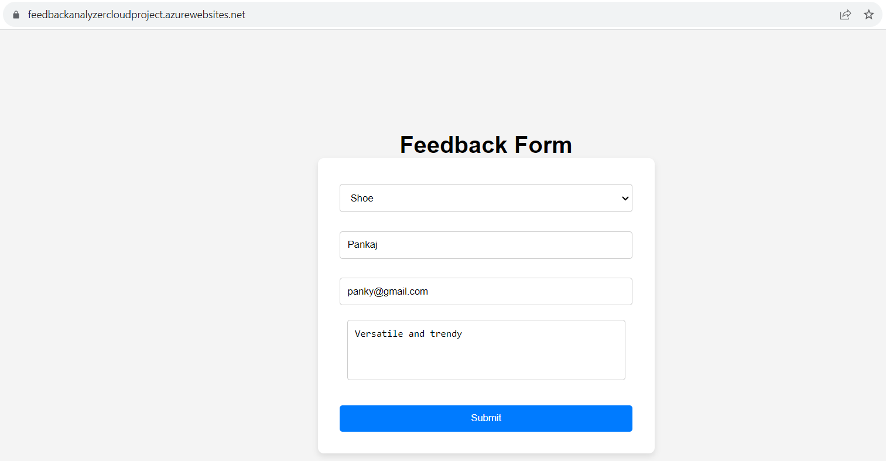
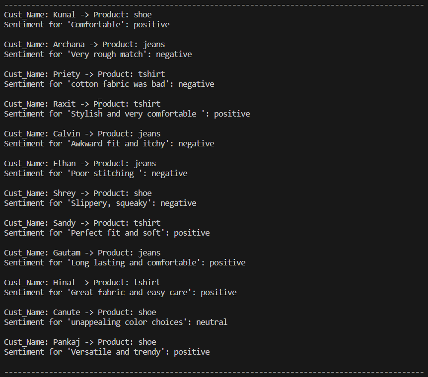
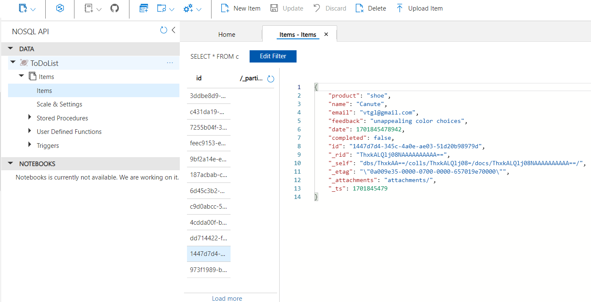

# 🧠 Microsoft Azure Feedback Analyzer  

A cloud-based **sentiment analysis web app** built using **Node.js**, **Azure App Services**, **Cosmos DB (NoSQL)**, and **Cognitive Services – Text Analytics API** to help businesses understand customer feedback in real time.

---

## 🎯 Purpose & Use Case  

Retail and e-commerce stores often collect customer feedback but struggle to analyze it efficiently.  
This project automates that process by using **Azure Cognitive Services** to classify sentiments as *positive*, *negative*, or *neutral*.

🛍️ **Use Case Example:**  
- A product store embeds this feedback form on their website.  
- Customers submit feedback about products.  
- The app stores each response in **Cosmos DB** and instantly runs **sentiment analysis** using Azure AI.  
- Store managers can then track patterns (e.g., “too small size,” “great fit,” “bad color options”) and take **data-driven actions** to improve product quality and customer satisfaction.

---

## 🚀 Project Overview  

Users submit feedback through a simple form built with **HTML/CSS/JavaScript**.  
Data is sent to a **Node.js backend**, stored in **Azure Cosmos DB**, and analyzed via **Azure Cognitive Services (Text Analytics API)**.  
The processed sentiment results are displayed on the console and stored for visualization or reporting.

---

## 🛠️ Tech Stack  

| Layer | Technology |
|:------|:------------|
| **Frontend** | HTML, CSS, JavaScript |
| **Backend** | Node.js (Express.js) |
| **Database** | Azure Cosmos DB (NoSQL API) |
| **AI/ML** | Azure Cognitive Services (Text Analytics API) |
| **Hosting** | Azure App Service |
| **Version Control** | GitHub |

---

## 🖼️ Screenshots  

### 🌐 Feedback Form  

### 🧠 Sentiment Analysis Results  

### ☁️ Cosmos DB – NoSQL Storage  

---

## 💡 Key Highlights  

- Built an **end-to-end cloud-native solution** integrating web, database, and AI services.  
- Enabled **real-time feedback processing** and sentiment tagging with 90%+ accuracy (via Azure Cognitive API).  
- Demonstrates **full-stack cloud deployment** using **Azure App Service** and **Cosmos DB**.  
- Highlights **data-driven decision-making**, **automation**, and **AI-powered analytics**.  

---

## 🧩 Project Structure  

